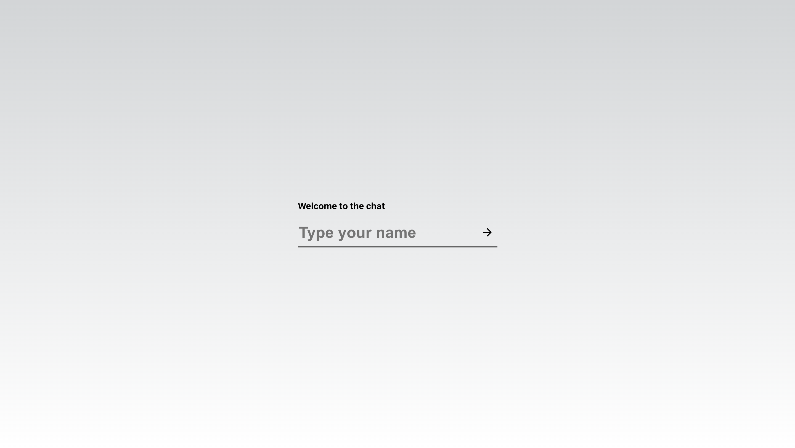
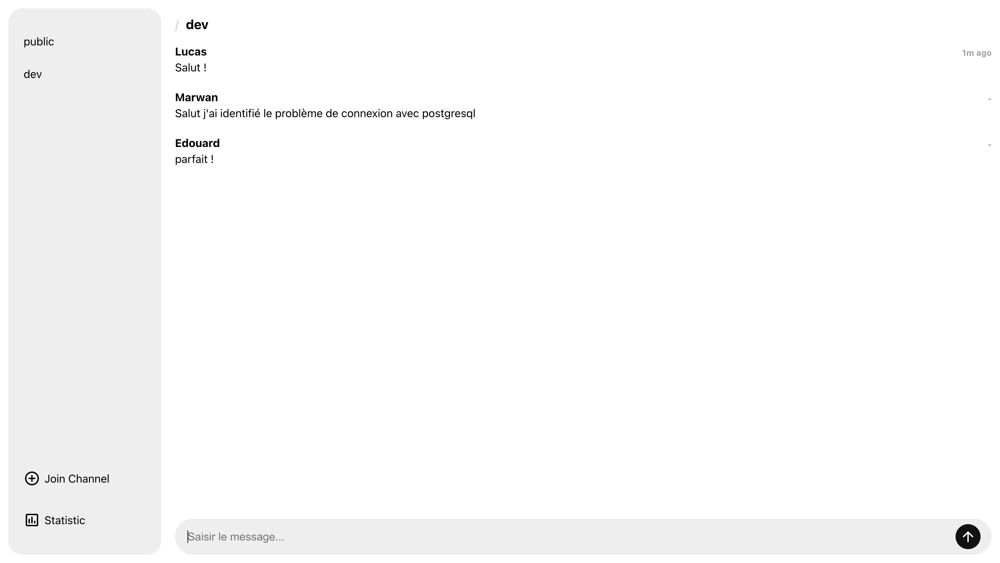
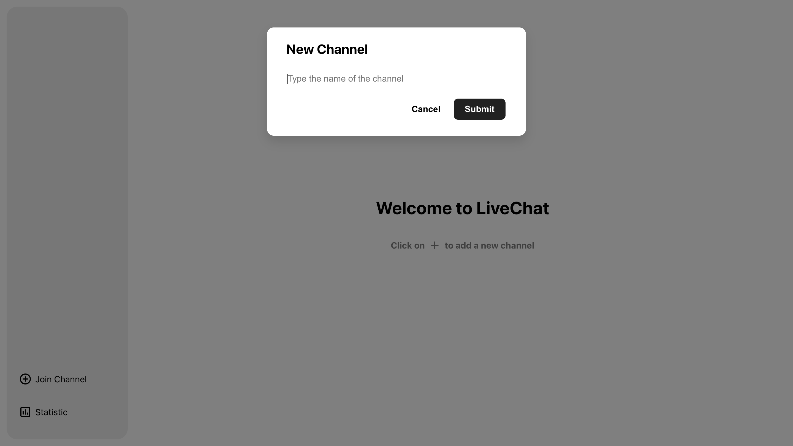
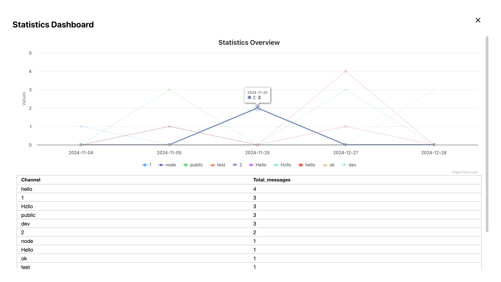

# LiveChat – Système de Chat en Temps Réel

Système de chat en temps réel construit avec Node.js, React, et WebSockets via la bibliothèque **socket.io**. L’objectif est de permettre à plusieurs utilisateurs d’échanger des messages instantanément dans différents canaux (channels), tout en offrant des statistiques d’utilisation (nombre de messages, top des canaux, etc.). 

Ce projet fait partie d’un travail scolaire visant à se familiariser avec les applications web et l’usage des technologies courantes dans l’écosystème JavaScript.

## Objectif et Motivation

- **Objectif principal** : Développer une solution de chat temps réel, modulaire et évolutive, où la communication se fait via WebSockets pour un rafraîchissement instantané des messages.
- **Motivation** :  
  1. Apprendre à intégrer un backend Node.js/Express avec une base de données relationnelle (PostgreSQL).  
  2. Comprendre le fonctionnement des WebSockets pour créer une expérience de messagerie fluide.  
  3. Mettre en pratique les compétences en React pour développer une interface réactive et ergonomique.

## Fonctionnalités Principales

1. **Chat en temps réel** : Envoi et réception instantanés des messages via WebSockets.  
2. **Gestion de canaux (channels)** : Possibilité de créer et rejoindre plusieurs canaux de discussion.  
3. **Historique des discussions** : Consultation de l’historique des messages
4. **Statistiques** : Visualisation des canaux les plus actifs et de la répartition des messages par jour sous forme de graphiques (Highcharts) et tableaux (AG Grid).  
5. **Interface conviviale** : Interface web développée en React, conçue pour faciliter la navigation et l’interaction.

## Architecture Générale

Le projet est découpé en deux grandes parties : 
- **backend/** (Node.js + Express + Socket.io + PostgreSQL)  
- **frontend/** (React + socket.io-client)

```
AtlasKing515-LiveChat/
    ├── backend/
    │   ├── db/
    │   ├── index.ts
    │   └── ...
    ├── frontend/
    │   ├── src/
    │   └── ...
    └── README.md
```

1. **Backend** : 
   - Fait office de serveur, écoute sur le port 8080.  
   - Gère les événements WebSockets pour l’échange de messages.  
   - Communique avec PostgreSQL pour stocker et récupérer les messages, et pour fournir des statistiques.

2. **Frontend** : 
   - Application React (port par défaut 3000 en développement).  
   - Utilise **socket.io-client** pour se connecter au serveur en WebSocket.  
   - Affiche l’interface de chat et les canaux, gère l’envoi/réception de messages, et propose un tableau de bord statistique.

## Technologies et Bibliothèques

- **Node.js** : Plateforme pour exécuter JavaScript côté serveur.  
- **Express** : Framework web pour Node.js.  
- **TypeScript** : Langage de programmation qui ajoute du typage statique à JavaScript.  
- **socket.io** : Bibliothèque pour gérer les WebSockets de manière simple et efficace.  
- **PostgreSQL** : Base de données relationnelle utilisée pour stocker les messages.  
- **React** : Bibliothèque JavaScript pour la création d’interfaces utilisateurs.  
- **AG Grid** : Tableau de données réactif pour l’affichage des canaux ou autres statistiques.  
- **Highcharts** : Librairie de visualisation de données pour afficher des graphiques (stats timeline, top canaux).  

## Installation et Configuration

Avant de commencer, assurez-vous d’avoir installé :

- [Node.js](https://nodejs.org/) (>= 14.x recommandé)  
- [npm](https://www.npmjs.com/) ou [Yarn](https://yarnpkg.com/)  
- Un serveur PostgreSQL local ou distant (>= 9.x)

### 1. Configuration de la Base de Données

1. Créez une base de données PostgreSQL (par exemple `postgres`).  
2. Dans le fichier `backend/db/db.ts`, ajustez si nécessaire les paramètres de connexion :

   ```js
   const sql = postgres({
       host: 'localhost',
       port: 5432,
       database: 'postgres',
       username: 'postgres',
       password: '12345678'
   });
   ```

3. Assurez-vous que votre base de données est accessible via les identifiants fournis.

### 2. Installation du Backend

```bash
cd backend
npm install
```

- Vérifiez et ajustez le fichier `backend/package.json` si vous souhaitez changer le script de démarrage ou les dépendances.

### 3. Installation du Frontend

```bash
cd ../frontend
npm install
```

- Vérifiez le fichier `frontend/package.json` si vous souhaitez personnaliser votre configuration de build ou de démarrage.

## Exécution en Local

1. **Démarrer le serveur** (dans un premier terminal) :

   ```bash
   cd backend
   npm start
   ```
   Cela va compiler le code TypeScript en JavaScript (dossier `dist/`) puis lancer le serveur sur [http://localhost:8080](http://localhost:8080).  

2. **Démarrer l’application React** (dans un second terminal) :

   ```bash
   cd frontend
   npm start
   ```
   Par défaut, l’application est accessible sur [http://localhost:3000](http://localhost:3000).  

Une fois les deux serveurs en marche, ouvrez votre navigateur à l’adresse [http://localhost:3000](http://localhost:3000). Vous pourrez alors choisir un nom d’utilisateur, rejoindre ou créer des canaux, et envoyer des messages en temps réel.

## Déploiement

Pour déployer en production, vous pouvez suivre ces grandes étapes :

1. **Build du frontend** :  
   ```bash
   cd frontend
   npm run build
   ```  
   Un dossier `build/` sera généré, contenant les fichiers statiques optimisés.

2. **Serveur Node.js** :  
   - Configurez un serveur (par exemple, via [PM2](https://pm2.keymetrics.io/) ou [Docker](https://www.docker.com/)).  
   - Assurez-vous de pointer votre application vers votre base de données PostgreSQL de production.  
   - Servez le contenu du dossier `build/` (du frontend) soit depuis un serveur statique (Nginx, Apache) ou via Express.

3. **Environnement** :  
   - Mettez à jour les variables (URL de la base de données, ports, etc.) selon vos besoins.  
   - Lancez la commande `npm start` (ou le script adéquat) dans le répertoire `backend` pour faire tourner l’API Node.js/Express et le service socket.io.

## Fonctionnement Interne du Chat en Temps Réel

### 1. Côté Serveur

- **Connexion WebSocket** : À chaque connexion, `socket.io` crée un objet `client` représentant le client connecté.  
- **Événements `set-username` et `join-channel`** : Le serveur associe un nom d’utilisateur au `client` et ajoute ce `client` dans la salle (room) du canal correspondant.  
- **Événement `message`** :  
  1. Le serveur reçoit l’objet `{ channel, body }`.  
  2. Il vérifie si le `client` est bien connecté au canal.  
  3. Il insère le message dans la base PostgreSQL.  
  4. Il diffuse (broadcast) le message aux autres utilisateurs du même canal.  
- **Événement `get-messages`** : Permet au client de récupérer l’historique des messages d’un canal, avec pagination.  

### 2. Côté Client

- **Initialisation** :  
  1. Le client se connecte au serveur via `socket.io-client` à l’URL `http://localhost:8080`.  
  2. Il définit son nom d’utilisateur (`setUsername`) lors de la première visite.  
- **Sélection de canaux** :  
  1. Le client émet l’événement `join-channel` pour s’abonner aux messages du canal.  
  2. Il peut, à la demande, appeler `get-messages` pour charger l’historique.  
- **Envoi de message** :  
  1. Lorsqu’un utilisateur envoie un message, le client émet l’événement `message` avec le corps du message et le canal cible.  
  2. Le serveur enregistre puis renvoie le message à tous les abonnés du canal (y compris l’expéditeur).  
- **Mise à jour en temps réel** :  
  1. À la réception de l’événement `message` en provenance du serveur, le client met à jour immédiatement la liste des messages affichés.  
  2. React gère le rendu afin de refléter l’arrivée d’un nouveau message sans recharger la page.

## Guide Utilisateur

### Accueil et Choix du Nom d’Utilisateur

- Au premier chargement de l’application, une page d’accueil (overlay) s’affiche pour inviter l’utilisateur à saisir un **nom d’utilisateur**.  
- Les noms d’utilisateurs sont soumis à une longueur minimale et maximale (3 à 36 caractères).  

### Interface de Chat

- **Panneau latéral (SidePanel)** : liste les canaux disponibles.  
- **Zone principale** : affiche la discussion courante ainsi que l’historique des messages.  
- **Zone de saisie** : située en bas de la zone principale, permet de taper un message et de l’envoyer.

### Ajout et Navigation entre les Canaux

1. **Créer/Rejoindre un canal** : Cliquez sur le bouton “Join Channel”.

2. **Basculer d’un canal à l’autre** : Cliquez sur le nom du canal dans la liste pour charger la conversation correspondante.  

### Statistiques

- Cliquez sur le bouton “Statistic” dans le panneau latéral pour ouvrir le tableau de bord statistique.  
- Vous verrez :  
  - **Un graphique** montrant le nombre de messages par jour et par canal.  
  - **Un tableau** affichant le top des canaux selon le volume de messages.  


## Aperçus visuels (Screenshots)

### **Page d’accueil – Choix du nom d’utilisateur**  
   

### **Interface principale de chat**  
     
   - **Panneau latéral** avec la liste des canaux.  
   - **Zone de discussion** pour le canal courant.  
   - **Zone de saisie**.

### **Création d’un nouveau canal**  
   

### **Statistiques**  
     
   - Graphique (Highcharts) montrant l’évolution du nombre de messages par jour.  
   - Tableau (AG Grid) listant les canaux les plus actifs.

## Équipe et Contributeurs

Ce projet a été réalisé de manière collaborative par trois membres dont les rôles et responsabilités se sont répartis de la façon suivante :

- ### MIAKINEN Lucas (50% du travail) : Chef de projet & Lead Back-End
  - Conception et mise en place de l’architecture du serveur Node.js/Express.  
  - Implémentation et intégration de la base de données PostgreSQL.  
  - Gestion des WebSockets (Socket.io) côté serveur et coordination de l’ensemble des fonctionnalités.

- ### BENNIS Marwan (30% du travail) : Lead Front-End
  - Développement de l’interface utilisateur avec React (architecture des composants, styling).  
  - Mise en place de la communication en temps réel (Socket.io Client).  
  - Intégration des bibliothèques tierces pour la visualisation des données (Highcharts, AG Grid).

- ### D’ABOVILLE Edouard (20% du travail) : DevOps & Support
  - Configuration et optimisation de l’environnement (scripts de déploiement, configuration du serveur).  
  - Participation aux tests et à la validation de la qualité du code.  
  - Aide et support ponctuel sur l’intégration du front-end et la gestion de la base de données.